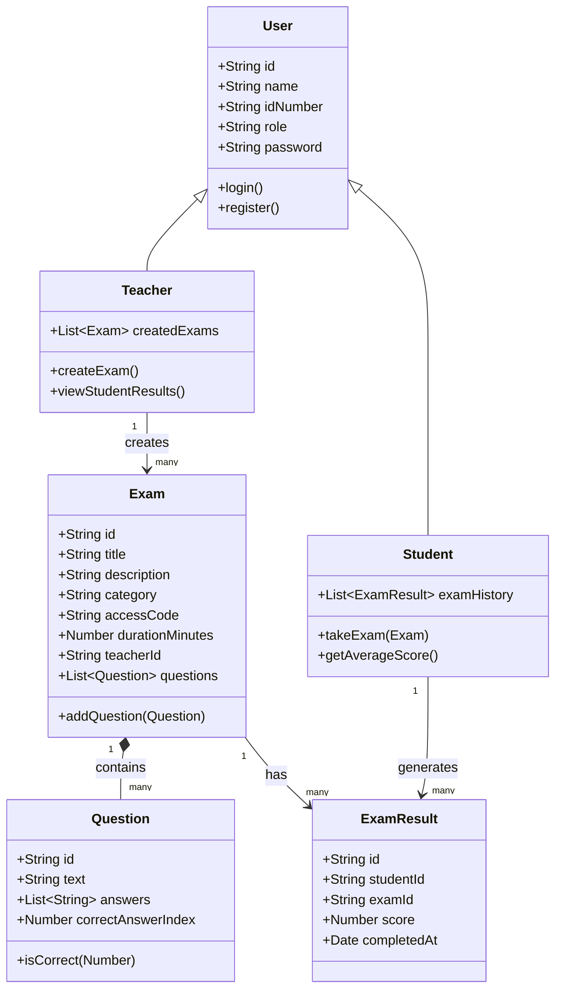
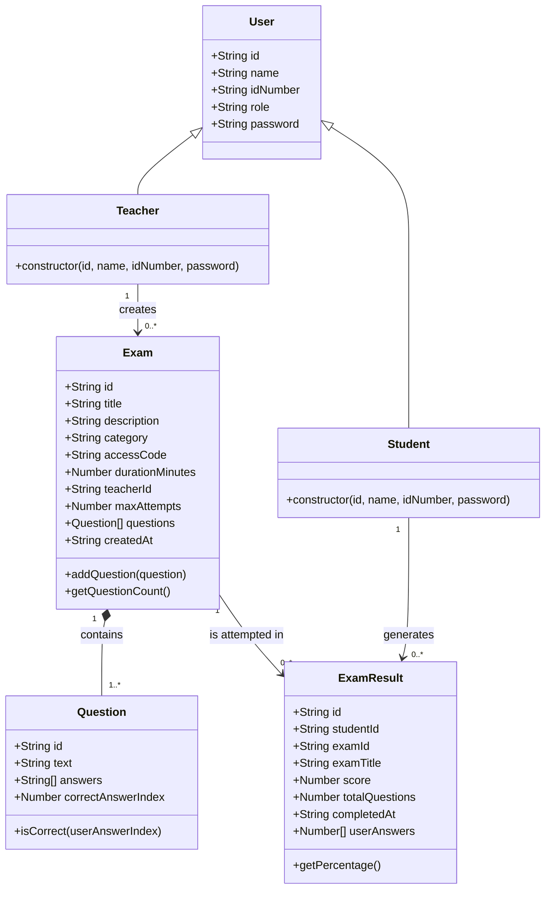

# Client-Side Exam Management System

A fully client-side web application for creating, managing, and taking multiple-choice exams. Teachers can build and publish exams; students can search for exams, take them, and review their performance over time. All data is persisted in the browser using `localStorage`—no backend server is required.

**Tech stack:** Vanilla JavaScript (ES Modules), strict Object-Oriented Programming with ES6 classes, HTML5, and CSS3.

## Features

### Teacher Capabilities

- Register and log in with a teacher account
- Create exams with title, description, category, access code, and duration
- Add, edit, and remove multiple-choice questions on each exam
- Edit existing exams from the teacher dashboard
- Delete exams from the teacher dashboard
- View a list of all exams created by the logged-in teacher
- View student results (scores and completion dates) for each exam when editing

### Student Capabilities

- Register and log in with a student account
- Search for available exams by title or access code
- Take exams with shuffled questions and answer options
- Submit exams and receive an immediate score with visual answer review (green for correct, red for incorrect)
- View exam history on the student dashboard, including score and percentage
- See average score across all completed exams
- Review past exams in detail, including which answers were selected and which were correct
- Toggle between light and dark mode

## Project Structure

The codebase follows a layered architecture that separates domain models, business logic, and presentation:

```
Web_Dev_Project/
├── index.html              # Landing page
├── pages/                  # Application HTML pages
│   ├── login.html
│   ├── register.html
│   ├── teacher-dashboard.html
│   ├── exam-details.html
│   ├── student-dashboard.html
│   ├── search-exam.html
│   ├── take-exam.html
│   └── view-result.html
├── css/
│   └── style.css           # Global styles and theme
└── js/
    ├── models/             # Domain entity classes
    ├── services/           # Business logic & localStorage access
    ├── pages/              # Page controllers (one per HTML page)
    └── theme.js            # Dark / light mode toggle
```

- **`pages/` (HTML)** — Application screens other than the landing page. Each file loads its matching controller from `js/pages/`.

- **`models/`** — Defines the core domain entities as ES6 classes (`User`, `Teacher`, `Student`, `Exam`, `Question`, `ExamResult`). These classes encapsulate data and behavior such as `Question.isCorrect()` and `Exam.addQuestion()`.

- **`services/`** — Handles application logic and persistence. Services read from and write to `localStorage`, keeping page controllers free of storage details. Examples: `AuthService` (registration, login, session), `ExamService` (CRUD for exams), `ResultService` (saving and retrieving exam results).

- **`js/pages/`** — Page-specific controllers (such as `teacher-dashboard.js`, `take-exam.js`, `view-result.js`) that wire together services, models, and the DOM for each HTML page.

## OOP Diagram



## Site Map & Navigation Flow

The application is split into public pages and role-protected pages. Public pages are available without an active session. Teacher and student pages validate the active session through `AuthService.getCurrentUser()` before rendering protected content.

```text
index.html
├── Login button ────────────────> pages/login.html
│                                   ├── AuthService.login(idNumber, password)
│                                   ├── role === "teacher" ─────> pages/teacher-dashboard.html
│                                   └── role === "student" ─────> pages/student-dashboard.html
│
└── Register button ─────────────> pages/register.html
                                    └── successful registration ─> pages/login.html

Teacher flow
------------
pages/teacher-dashboard.html
├── Create New Exam ─────────────> pages/exam-details.html
├── Edit exam card ──────────────> pages/exam-details.html?id={examId}
├── Delete exam card ────────────> ExamService.deleteExam(examId)
└── Logout ──────────────────────> AuthService.logout() ─> index.html

pages/exam-details.html
├── Save Exam ───────────────────> ExamService.saveExam(exam)
│                                   └── redirect ─────────> pages/teacher-dashboard.html
├── Cancel ──────────────────────> pages/teacher-dashboard.html
└── Logout ──────────────────────> AuthService.logout() ─> index.html

Student flow
------------
pages/student-dashboard.html
├── Search for Exam ─────────────> pages/search-exam.html
├── Review Exam ─────────────────> pages/view-result.html?resultId={resultId}
└── Logout ──────────────────────> AuthService.logout() ─> index.html

pages/search-exam.html
├── Search submit ───────────────> ExamService.getAllExams()
├── Take Exam result card ───────> pages/take-exam.html?id={examId}
├── Back to Dashboard ───────────> pages/student-dashboard.html
└── Logout ──────────────────────> AuthService.logout() ─> index.html

pages/take-exam.html
├── Submit Exam ─────────────────> grade attempt and save ExamResult
├── Return to Dashboard ─────────> pages/student-dashboard.html
├── Back to Search ──────────────> pages/search-exam.html
└── Logout ──────────────────────> AuthService.logout() ─> index.html

pages/view-result.html
├── Back to Dashboard ───────────> pages/student-dashboard.html
└── Logout ──────────────────────> AuthService.logout() ─> index.html
```

Route access rules:

- `index.html`, `pages/login.html`, and `pages/register.html` are public.
- `pages/teacher-dashboard.html` and `pages/exam-details.html` require `currentUser.role === "teacher"`.
- `pages/student-dashboard.html`, `pages/search-exam.html`, `pages/take-exam.html`, and `pages/view-result.html` require `currentUser.role === "student"`.
- Any unauthenticated user, or any authenticated user with the wrong role for a page, is redirected to `pages/login.html`.
- The global logout button calls `AuthService.logout()`, removes `currentUser` from `localStorage`, and redirects to `index.html`.

## LocalStorage Data Schemas

All persistent data is stored in the browser with `localStorage`. Services serialize JavaScript objects with `JSON.stringify()` and read them back with `JSON.parse()`. `ExamService` and `ResultService` rehydrate stored objects into model instances where behavior such as `Exam.getQuestionCount()`, `Question.isCorrect()`, and `ExamResult.getPercentage()` is needed.

### `users`

The `users` key stores an array of registered teachers and students. Teacher and student records share the base `User` fields and differ by the `role` value.

```json
[
  {
    "id": "1720000000000",
    "name": "Dana Teacher",
    "idNumber": "111111111",
    "role": "teacher",
    "password": "teacher-pass"
  },
  {
    "id": "1720000001000",
    "name": "Amit Student",
    "idNumber": "222222222",
    "role": "student",
    "password": "student-pass"
  }
]
```

### `currentUser`

The `currentUser` key stores the active logged-in user. It is created by `AuthService.login()` and removed by `AuthService.logout()`.

```json
{
  "id": "1720000001000",
  "name": "Amit Student",
  "idNumber": "222222222",
  "role": "student",
  "password": "student-pass"
}
```

### `exams`

The `exams` key stores an array of exams created by teachers. Each exam contains a nested `questions` array. Every question stores four answer options and the zero-based index of the correct option.

```json
[
  {
    "id": "17200000020000.123456789",
    "title": "JavaScript Basics",
    "description": "A short exam about JavaScript fundamentals.",
    "category": "Web Development",
    "accessCode": "JS101",
    "durationMinutes": 60,
    "teacherId": "1720000000000",
    "maxAttempts": 2,
    "questions": [
      {
        "id": "17200000030000.987654321",
        "text": "Which keyword declares a block-scoped variable?",
        "answers": ["var", "let", "function", "return"],
        "correctAnswerIndex": 1
      },
      {
        "id": "17200000040000.456789123",
        "text": "Which method converts an object to a JSON string?",
        "answers": ["JSON.parse", "JSON.stringify", "Object.keys", "Array.from"],
        "correctAnswerIndex": 1
      }
    ],
    "createdAt": "2026-07-09T07:00:00.000Z"
  }
]
```

### `exam_results`

The `exam_results` key stores submitted student attempts. `userAnswers` is an array of zero-based answer indexes in the original exam question order. This allows the review page to compare the student's stored answers against each `Question.correctAnswerIndex`.

```json
[
  {
    "id": "1720000005000",
    "studentId": "1720000001000",
    "examId": "17200000020000.123456789",
    "examTitle": "JavaScript Basics",
    "score": 2,
    "totalQuestions": 2,
    "completedAt": "2026-07-09T07:10:00.000Z",
    "userAnswers": [1, 1]
  }
]
```

## OOP Class Diagram (UML)

The project uses ES Modules and ES6 classes for the core domain objects. Services operate on these model objects and page controllers connect them to the DOM.



## Core Application Flows

### Flow 1: Exam Submission and Grading

This flow starts when a student is on `pages/take-exam.html` and clicks the `Submit Exam` button.

1. `take-exam.js` runs `init()` when the module loads. It calls `AuthService.getCurrentUser()` and requires a logged-in student. If the user is missing or is not a student, the page redirects to `pages/login.html`.
2. `init()` reads the exam ID from the URL with `getExamIdFromUrl()`, then calls `examService.getExamById(examId)`. `ExamService` reads the `exams` key from `localStorage`, parses the stored JSON, and rehydrates each stored exam into an `Exam` instance with nested `Question` instances.
3. Before rendering the exam, `take-exam.js` checks that the exam exists, has questions, and that the student has not exceeded `currentExam.maxAttempts`. Attempts are counted by calling `resultService.getResultsByStudent(currentUser.id)` and filtering those results by `examId`.
4. The exam questions are shuffled with `shuffleQuestions()`. Each question's answer options are also shuffled with `shuffleAnswers()`, but each option keeps its original answer index in the radio input value. This preserves correct grading even when the display order changes.
5. When the student clicks `Submit Exam`, the `handleSubmitExam()` event handler runs. It first validates that every question has a selected radio input by calling `getSelectedOriginalIndex(questionIndex)` for each rendered question.
6. If any question is unanswered, `showExamError()` displays a validation message and no result is saved.
7. If all questions are answered, `handleSubmitExam()` calls `calculateScore(currentExam)`. That function loops through `currentExam.questions`, reads each selected original answer index, and calls `question.isCorrect(userAnswerIndex)`. The `Question` model compares the submitted index against `correctAnswerIndex`.
8. `handleSubmitExam()` then reloads the original persisted exam by calling `examService.getExamById(currentExam.id)`. This is needed because the rendered exam was shuffled. `collectUserAnswers(currentExam, originalExam)` maps the selected answer indexes back into the original question order for stable storage and review.
9. A new `ExamResult` is created with `studentId`, `examId`, `examTitle`, `score`, `totalQuestions`, `completedAt`, and `userAnswers`.
10. `resultService.saveResult(examResult)` reads the current `exam_results` array from `localStorage`, appends the new result, and writes the updated array back using `localStorage.setItem("exam_results", JSON.stringify(results))`.
11. The student immediately sees the final score and percentage. `showAnswerReview(currentExam)` disables all radio buttons and visually marks correct and incorrect answers.
12. Teacher result visibility happens through `pages/exam-details.html?id={examId}`. When a teacher edits an existing exam, `exam-details.js` calls `renderStudentResults(exam.id)`. That function calls `resultService.getResultsByExam(examId)`, rehydrates each stored result into an `ExamResult`, looks up each student with `AuthService.getUsers()`, and populates the teacher's results table with student name, score, percentage, and completion date.

### Flow 2: Authentication and Route Protection

Authentication is managed by `AuthService` and the active session is stored in `localStorage` under the `currentUser` key.

1. On registration, `register.js` reads the submitted name, ID number, password, and role from `pages/register.html`. It calls `AuthService.register(name, idNumber, role, password)`.
2. `AuthService.register()` loads the `users` array, rejects duplicate `idNumber` values, creates either a `Teacher` or `Student` instance, appends it to the users array, and saves the array back to `localStorage`.
3. On login, `login.js` calls `AuthService.login(idNumber, password)`. `AuthService.login()` searches the stored `users` array for matching credentials. If a match is found, it writes that user object to `localStorage` as `currentUser`.
4. After successful login, `login.js` routes teachers to `pages/teacher-dashboard.html` and students to `pages/student-dashboard.html`.
5. Every secured page controller performs its route guard at the top of `init()` before loading protected data or attaching most page behavior:
   - `teacher-dashboard.js` requires `currentUser.role === "teacher"`.
   - `exam-details.js` requires `currentUser.role === "teacher"`.
   - `student-dashboard.js` requires `currentUser.role === "student"`.
   - `search-exam.js` requires `currentUser.role === "student"`.
   - `take-exam.js` requires `currentUser.role === "student"`.
   - `view-result.js` requires `currentUser.role === "student"`.
6. If `AuthService.getCurrentUser()` returns `null`, or if the role does not match the page scope, the controller redirects immediately to `pages/login.html` and stops execution with `return`.
7. Additional object-level authorization is enforced where needed. `exam-details.js` only allows a teacher to edit an exam when `exam.teacherId === currentUser.id`. `view-result.js` only allows a student to review a result when `result.studentId === currentUser.id`.
8. The shared authenticated navbar includes a global `Logout` button. Each secured controller attaches a click listener to `#logout-btn`. The handler calls `AuthService.logout()`, which removes `currentUser` from `localStorage`, then redirects the browser to `index.html`. After logout, secured pages no longer pass their route guard.
