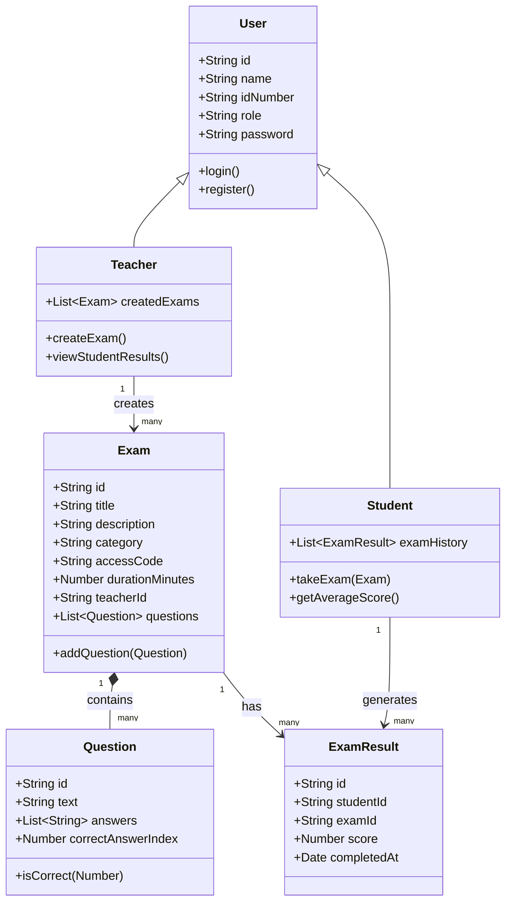

# Client-Side Exam Management System

A fully client-side exam management platform built with Vanilla JavaScript. Teachers can create and manage exams, while students can search for exams, take them, and track their performance — all running in the browser with `localStorage` as the simulated database.

**Author:** Tomer Elimeleh | ID: 208895870

---

## Features

### Teacher
- Register and log in with a teacher account
- View a personal dashboard listing all created exams
- Create exams with title, description, category, access code, and duration
- Build exams with multiple-choice questions (4 answers each)
- Edit and delete draft questions before saving
- Save exams tied to the logged-in teacher's ID
- Log out securely

### Student
- Register and log in with a student account
- View a dashboard with exam history and average score
- Search for exams by title or access code
- Take exams with shuffled question order (bonus feature)
- Submit answers and receive an immediate score
- View past results with date, score, and percentage
- Log out securely

### Bonus Features
- **Question Shuffle:** Questions are randomized each time a student starts an exam
- **Dark Mode:** Toggle between light and dark themes; preference is saved in `localStorage`

---

## Project Structure

The project follows a modular ES Modules architecture with clear separation of concerns:

```
Web_Dev_Project/
├── index.html                  # Landing page
├── login.html / register.html  # Authentication pages
├── teacher-dashboard.html      # Teacher home
├── exam-details.html           # Exam creation form
├── student-dashboard.html      # Student home
├── search-exam.html            # Exam search
├── take-exam.html              # Exam runner
├── css/
│   └── style.css               # Shared styles (including dark mode)
└── js/
    ├── models/                 # OOP data classes
    │   ├── User.js
    │   ├── Teacher.js
    │   ├── Student.js
    │   ├── Exam.js
    │   ├── Question.js
    │   └── ExamResult.js
    ├── services/               # Business logic & localStorage access
    │   ├── AuthService.js
    │   ├── ExamService.js
    │   └── ResultService.js
    ├── theme.js                # Dark mode toggle utility
    ├── login.js                # Page controllers
    ├── register.js
    ├── teacher-dashboard.js
    ├── exam-details.js
    ├── student-dashboard.js
    ├── search-exam.js
    └── take-exam.js
```

- **`models/`** — Plain OOP classes representing domain entities (`User`, `Exam`, `Question`, etc.)
- **`services/`** — Static or instance-based classes that handle data persistence and business rules via `localStorage` / `sessionStorage`
- **Page controllers (`js/*.js`)** — Each HTML page has a matching JS file that handles auth guards, DOM rendering, and user interactions

---

## OOP Diagram



---

## Tech Stack

- **Language:** Vanilla JavaScript (ES Modules)
- **Architecture:** Object-Oriented Programming (OOP) with class-based models
- **Persistence:** `localStorage` (users, exams, results) and `sessionStorage` (current session)
- **Styling:** Custom CSS with CSS variables and dark mode support

---

## Getting Started

1. Clone or download the repository
2. Open `index.html` in a modern browser (Chrome, Firefox, Edge)
3. Register as a **Teacher** or **Student**
4. No build step or server required — the app runs entirely in the browser

---

## Data Storage Keys

| Key            | Storage        | Description              |
|----------------|----------------|--------------------------|
| `users`        | localStorage   | Registered user accounts |
| `exams`        | localStorage   | All created exams        |
| `exam_results` | localStorage   | Student exam results     |
| `currentUser`  | sessionStorage | Active logged-in user    |
| `theme`        | localStorage   | Light/dark mode preference |
