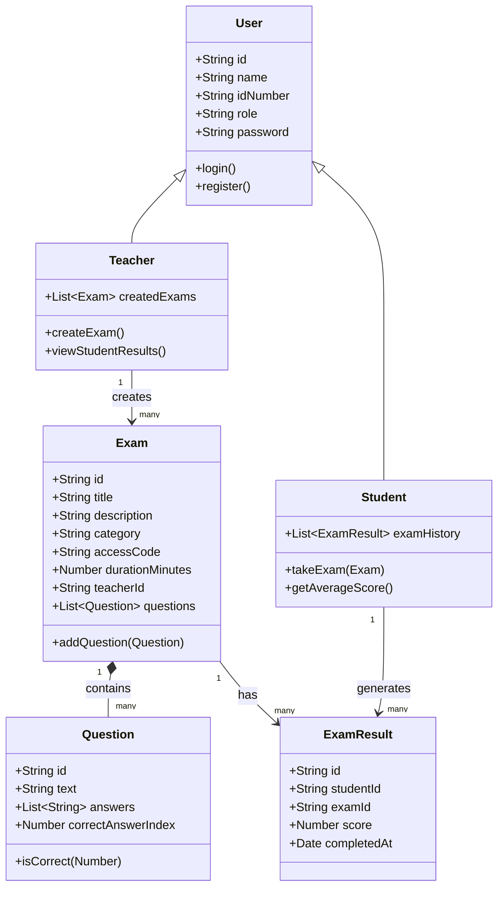

# Client-Side Exam Management System

A fully client-side web application for creating, managing, and taking multiple-choice exams. Teachers can build and publish exams; students can search for exams, take them, and review their performance over time. All data is persisted in the browser using `localStorage`—no backend server is required.

**Tech stack:** Vanilla JavaScript (ES Modules), strict Object-Oriented Programming with ES6 classes, HTML5, and CSS3.

## Features

### Teacher Capabilities

- Register and log in with a teacher account
- Create exams with title, description, category, access code, and duration
- Add, edit, and remove multiple-choice questions on each exam
- Edit existing exams from the teacher dashboard
- Delete exams from the teacher dashboard
- View a list of all exams created by the logged-in teacher
- View student results (scores and completion dates) for each exam when editing

### Student Capabilities

- Register and log in with a student account
- Search for available exams by title or access code
- Take exams with shuffled questions and answer options
- Submit exams and receive an immediate score with visual answer review (green for correct, red for incorrect)
- View exam history on the student dashboard, including score and percentage
- See average score across all completed exams
- Review past exams in detail, including which answers were selected and which were correct
- Toggle between light and dark mode

## Project Structure

The codebase follows a layered architecture that separates domain models, business logic, and presentation:

```
Web_Dev_Project/
├── index.html              # Landing page
├── pages/                  # Application HTML pages
│   ├── login.html
│   ├── register.html
│   ├── teacher-dashboard.html
│   ├── exam-details.html
│   ├── student-dashboard.html
│   ├── search-exam.html
│   ├── take-exam.html
│   └── view-result.html
├── css/
│   └── style.css           # Global styles and theme
└── js/
    ├── models/             # Domain entity classes
    ├── services/           # Business logic & localStorage access
    ├── pages/              # Page controllers (one per HTML page)
    └── theme.js            # Dark / light mode toggle
```

- **`pages/` (HTML)** — Application screens other than the landing page. Each file loads its matching controller from `js/pages/`.

- **`models/`** — Defines the core domain entities as ES6 classes (`User`, `Teacher`, `Student`, `Exam`, `Question`, `ExamResult`). These classes encapsulate data and behavior such as `Question.isCorrect()` and `Exam.addQuestion()`.

- **`services/`** — Handles application logic and persistence. Services read from and write to `localStorage`, keeping page controllers free of storage details. Examples: `AuthService` (registration, login, session), `ExamService` (CRUD for exams), `ResultService` (saving and retrieving exam results).

- **`js/pages/`** — Page-specific controllers (such as `teacher-dashboard.js`, `take-exam.js`, `view-result.js`) that wire together services, models, and the DOM for each HTML page.

## OOP Diagram


